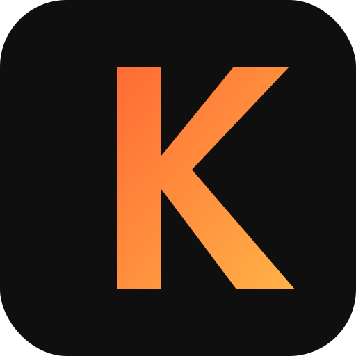

# Kern

Agent framework optimized for small models (2-4B parameters). Forked from [Agno](https://github.com/agno-agi/agno).

Small models struggle with complex JSON Schema — `$defs`, `properties`, `anyOf`, `allOf` chains confuse them. Kern replaces all of that with simple fill-in-the-blanks templates that any model can follow.

## What's different from Agno

- **Template-based structured output** — generates flat JSON templates instead of JSON Schema
- **JSON repair** — `json_repair` + LaTeX protection handles malformed responses from small models
- **Targeted retry** — validation failures get a focused retry with error context

Everything else (agents, tools, workflows, models, vector DBs, knowledge bases) works the same as Agno.

## Install

```bash
pip install kern
```

With extras:

```bash
pip install kern[openai]       # OpenAI model
pip install kern[ollama]       # Ollama model
pip install kern[ddg,mcp]      # DuckDuckGo search + MCP tools
pip install kern[all]          # Everything
```

## Quick start

```python
from pydantic import BaseModel
from kern.agent import Agent
from kern.models.openai import OpenAIChat


class Story(BaseModel):
    title: str
    body: str
    tags: list[str]


agent = Agent(
    model=OpenAIChat(id="gpt-4o-mini"),
    response_model=Story,
)

result = agent.run("Write a short sci-fi story about a robot")
print(result.content)  # Story(title=..., body=..., tags=[...])
```

## How templates work

Instead of sending this JSON Schema:

```json
{
  "$defs": {"Story": {"properties": {"title": {"type": "string"}, ...}}},
  "properties": {"result": {"$ref": "#/$defs/Story"}},
  "required": ["result"]
}
```

Kern sends this template:

```
JSON structure (replace type placeholders with actual values):
{"title": "string", "body": "string", "tags": ["string"]}
```

Small models follow the template reliably — no more `{"$schema": "...", "type": "object"}` in responses.

### Union types

```python
from typing import Union

class TextBlock(BaseModel):
    text: str

class CodeBlock(BaseModel):
    code: str
    language: str

class Page(BaseModel):
    blocks: list[Union[TextBlock, CodeBlock]]
```

Generates:

```json
{"blocks": [{"text": "string"}, {"code": "string", "language": "string"}]}
```

Both alternatives shown flat — no nesting, no `anyOf`.

## LaTeX protection

When your model outputs math like `\\frac{a}{b}`, JSON parsers break because `\f` is a form-feed escape. Kern doubles the backslash before parsing and repairs the JSON:

```python
from kern.repair import extract_json

data = extract_json('{"formula": "\\frac{1}{2} + \\theta"}')
# {"formula": "\\frac{1}{2} + \\theta"}  — parsed correctly
```

## Compatibility

Kern is a fork of Agno v2.5.14. All Agno APIs work with `from kern.` instead of `from agno.`:

```python
# Before (Agno)
from agno.agent import Agent
from agno.models.openai import OpenAIChat

# After (Kern)
from kern.agent import Agent
from kern.models.openai import OpenAIChat
```

## License

Apache License 2.0 — same as Agno.
